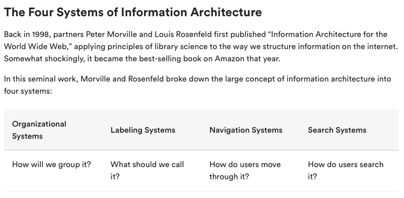
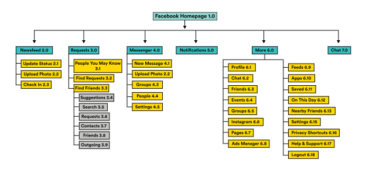
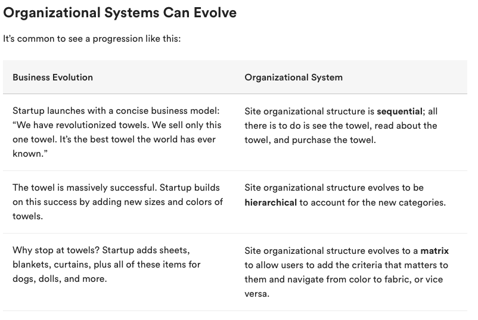
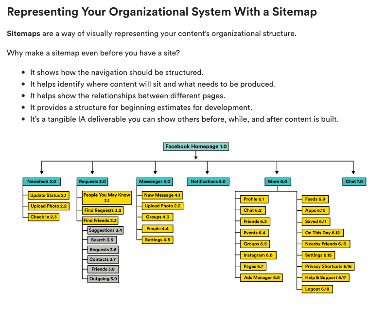
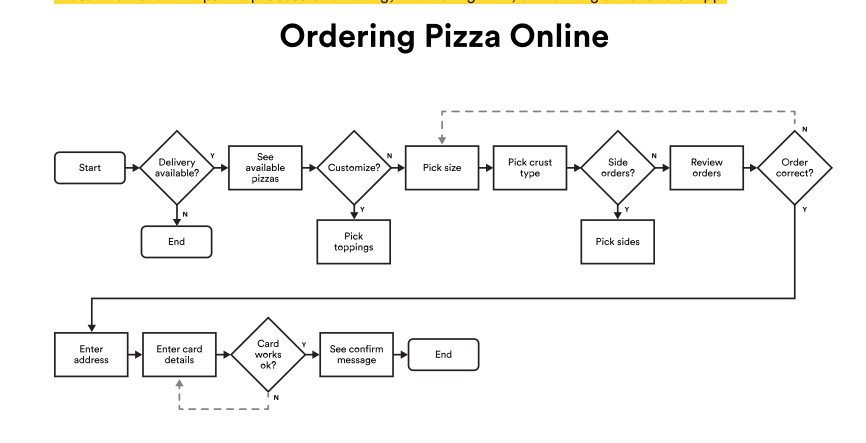

# Information Architecture:

## Organizational Systems:
* Sequential:
    - In sequential systems, information is presented to users in a linear, step-by-step fashion.
    - Mobile apps frequently make use of sequential organizational systems, like in an app onboarding flow.
* Hierarchial:
    - Just like a family tree with ancestors up top and their thousands of offspring at the bottom, the top level of a hierarchical structure has the fewest, most significant categories. To get to something at the bottom, users start somewhere around the top.
    - We often see site navigation and sitemaps represented in this way.
    - 
* Matrix:
    - In a matrix structure, content can be grouped in multiple ways, and one isn’t necessarily more significant than the other.
    - Think about the Netflix interface. This is achieved through behind-the-scenes “metadata,” which is just a fancy way of saying data that describes data. Very... meta, right?
    - Picture columns in a spreadsheet next to each show title. Refactoring these columns or metadata elements allows Netflix to serve up categories of content that feel personalized to each user.
    - A matrix structure allows a user to create navigational structures on the fly through the use of content metadata. When you’re using multiple filters on a website search, you’re using a matrix structure.

### Labeling: 
- Labeling sounds simple enough, but it never is, because the same phrases rarely mean the exact same thing to two different people — or even to the same person in different contexts.
- You may also find that stakeholders in your company who are far removed from product design suddenly want to be involved when it comes to what things should be called.
- You won’t win every labeling battle. But remember to bring user research and data to the conversation. And, whatever labels are chosen, use them consistently across the product.

### Bringing Organization and Labeling Together:
- Together, organizational systems and labeling systems make up a site’s content hierarchy and taxonomy. You and your company determine this, and it exists whether or not users are interacting with it.
- The next two systems — navigation and search — are a result of users interacting with your content. Although you don’t fully determine them, the design decisions you make will guide and impact the success of those interactions.

### Navigation:
- Navigation is how a user moves through a system to achieve their goal.
- You might have pictured a site navigation menu when you heard this term, and that’s certainly an important piece. But users often navigate through a system without ever using the menu.
- They might search for something that brings them to a subpage and, from there, click on links to get to where they need to go next. These actions are the steps of a user flow.

### Understanding Navigation With User Flows:
- A user flowchart maps the process of entering, interacting with, and exiting a website or app.

#### Designing for Easy Navigation:
* Ensure that noticeable, identifiable, and accurate links are on the page.
* Remove clutter so that users can clearly move to the next step of their journey.
* Use the correct labels.
* Use sidebars, breadcrumbs, and site menus to help users move forward, backward, and out of a predicted user flow.

### System 4: Search:
- Most of the time, users aren’t navigating through menus and category pages to find what they want. They’re going directly to search, even if they only have a vague idea of what they’re interested in.
- Behind effective search and recommendation algorithms is typically content that contains a good deal of behind-the-scenes metadata. This gives weight to aspects of the content that may not be captured in titles and keywords.
- For example, if you search a car rental site for Audi and BMW shows up, it might be because those two types of cars were attributed with similar metadata:

